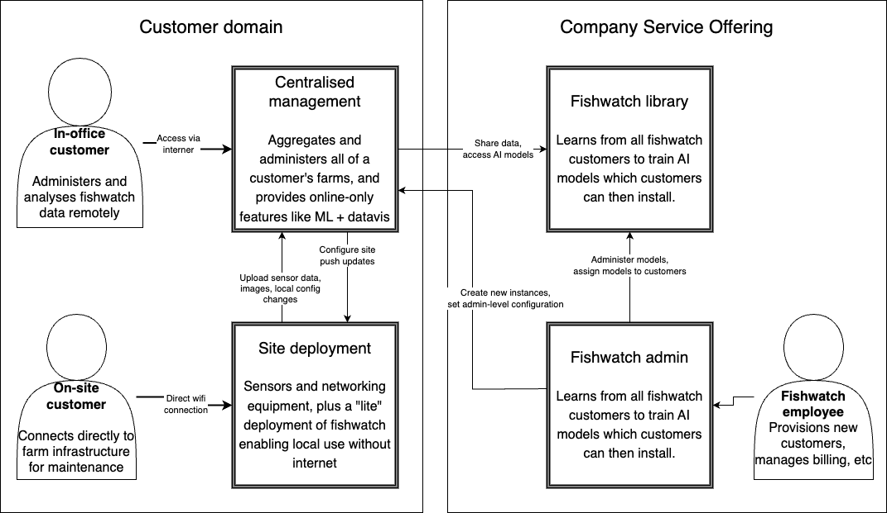
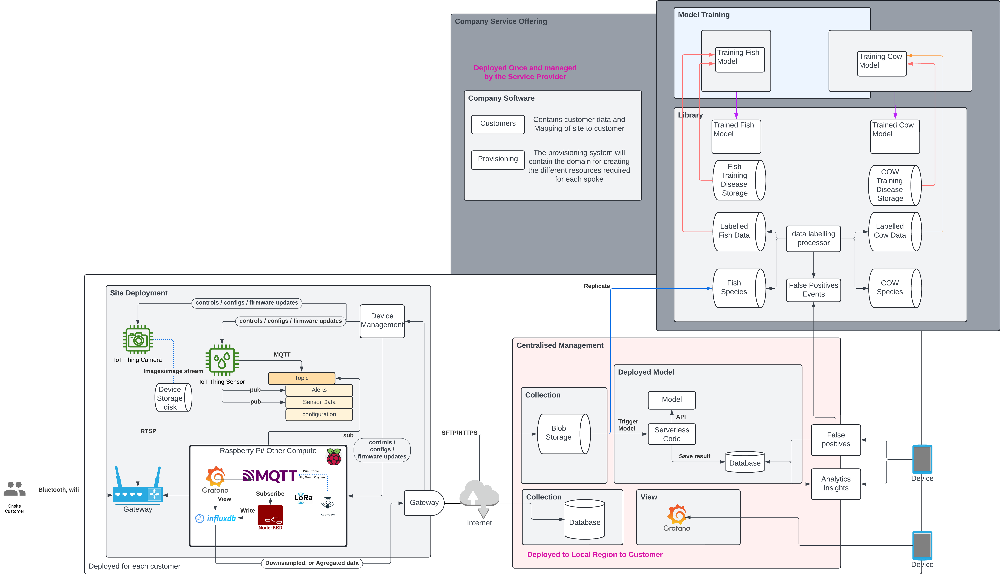
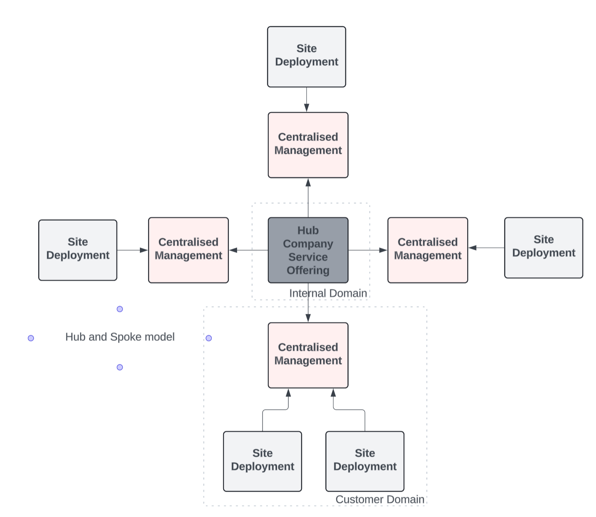
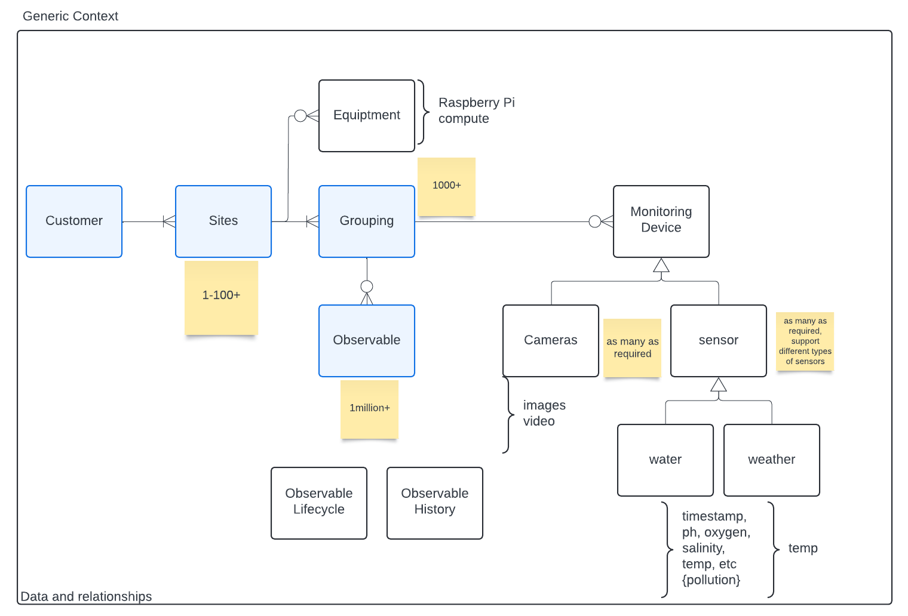
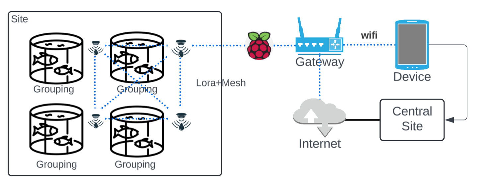
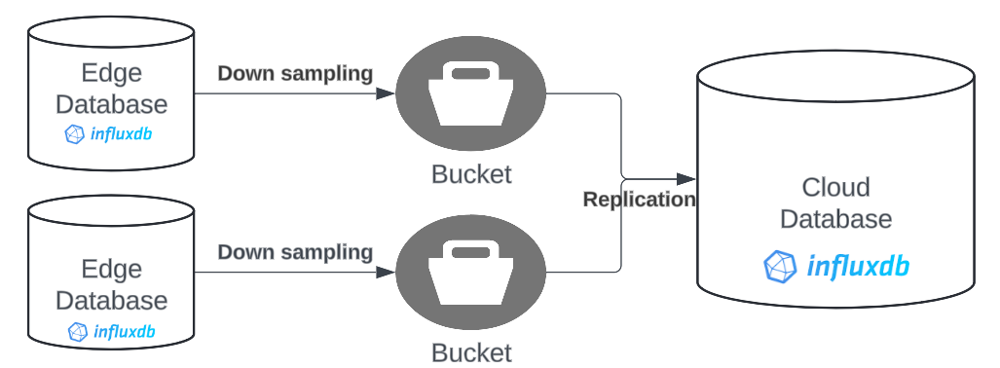
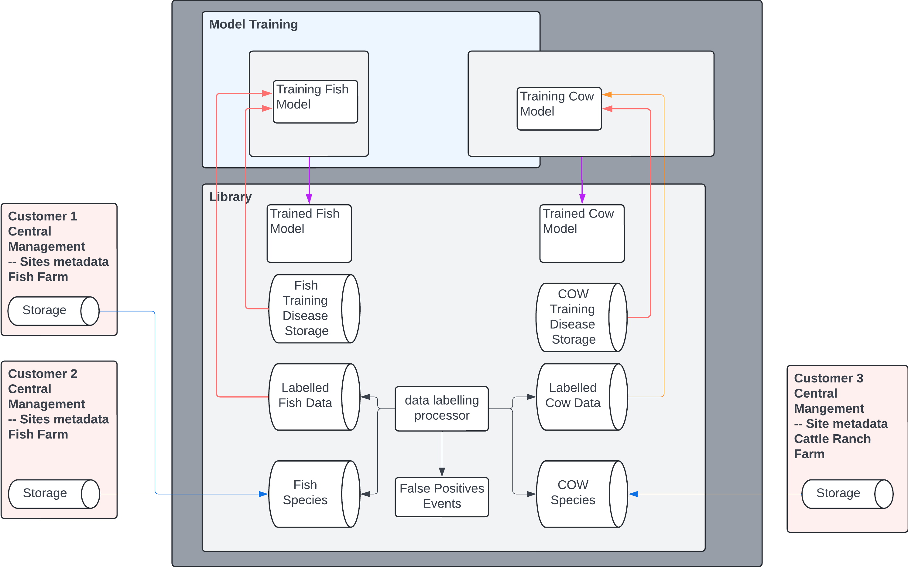
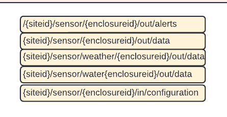

# Fishwatch

[Team](#team)
[Business problem](#business-problem)
[Our approach](#our-approach)
[Context + Container diagrams](#context-+-container-diagrams)
[Hub and Spoke Deployment](#hub-and-spoke-deployment)
[Data relationships](#data-relationships)
[Data from the edge](#data-from-the-edge)
[Training of the model](#training-of-the-model)
[Organisation of the topics](#organisation-of-the-topics)
[Assumptions](#assumptions)
[ADRs](#adrs)
[ADR 1: Use of generic entities](#adr-1:-use-of-generic-entities)
[ADR 2: Power, bandwidth and range](#adr-2:-power,-bandwidth-and-range)
[ADR 3: Use of low code tooling](#adr-3:-use-of-low-code-tooling)
# Team

Cam Jackson

Calvin Kodian

George Georgiou

# Business problem

Fishwatch is an integrated hardware and software solution for farmers who want to monitor, analyse, and optimise their farms. Sensor data drives both real-time alerts and long-term insights for customers ranging from single-farm operations, to global corporations with hundreds of farms and millions of fish. The software must be usable for analysts in well-connected offices, as well as for farmers in remote locations with “rugged” devices and unreliable internet.

# Our approach

We have designed a system that is adaptable across various domains, not limited to fishing, but extendable to industries such as manufacturing or land-based operations facing similar challenges. Our design focuses on deploying sensors in the field, collecting, consolidating, and visualising data, allowing users to observe trends or conditions relevant to their specific domain. We aimed for a solution that is both reusable and customisable to cater to the needs and language preferences of individual customers, ensuring relevance and ease of use.

One of the primary challenges we addressed was the remote deployment of these systems, considering the diverse environmental conditions they might encounter. Therefore, our approach prioritised local deployment with built-in redundancies tailored to each customer's requirements. This ensures reliability and functionality even in remote locations.

We aimed to deliver a consistent user experience regardless of the scale or size of the deployment location. By dividing the technology solution into collection, analytics, and management components, we allow for scalability and flexibility. The core aspect revolves around data collection and visualisation, which customers can access to make informed decisions within their domain. Local deployments are designed to operate autonomously, with the option to connect to a central server for enhanced functionality and management.

Analytics and learning capabilities are integrated to provide deeper insights and enable data-driven decision-making. Site management functionality allows for centralised management and analysis, particularly beneficial for larger installations with growing data volumes. Local deployments are equipped with limited storage, necessitating centralised management for extensive data analysis.

Our system offers customisation based on deployment scale and evolving needs, facilitating easy addition or removal of locations, groupings, sensors, or data types. A comprehensive list of sensors with their associated metrics and values streamlines deployment and configuration processes.

To ensure accessibility without internet connectivity, we have leveraged technologies for local deployment, allowing customers to view statistics and access information offline. This ensures usability and reliability in remote locations where internet connectivity may be limited or unavailable.

In summary, our system provides a robust, adaptable, and user-friendly solution for various domains facing similar challenges, ensuring relevance, scalability, and accessibility in diverse operating environments.

## Context + Container diagrams

The following context diagram shows an overview of the system, its users, and how they interact with each other.

The below container diagram gives more detailed information on each of the boxes in the above diagram.

## Hub and Spoke Deployment

Each customer would be deployed in their own tenant and have their own instance, this would setup as a hub and spoke model.  Each customer’s deployment would be isolated from other customers.  This will allow for the deployment for each customer that utilises the central site management to deploy to the nearest region.

# Data relationships

The following diagrams illustrate the relationships between the entities that would be present in the system. The highlighted section shows use of generic entities (e.g. “site” rather than “farm”), enabling the solution to be extended to other domains. A more specific application to the presented model is below.

- A **Customer** is the company or legal entity paying for the solution

- A **Site** is a geographic location being monitored, e.g. a farm or installation

- A **Grouping** is a physical section of a site, e.g. an enclosure or a paddock

- An **Observable** is the individual asset being monitors, e.g. a fish, cow, or solar panel

While generic terminology is helpful for extensibility, it is less user-friendly. Hence, a localisation module would allow the customer to configure the system to speak their language. This would allow the customer to monitor “fish” rather than “observables”.

A deployment would be something like the following, annotations back to the generic context is on the left. The following diagram shows a grouping of 4 enclosures each with an observable sensor.  The “grouping” in this case is an enclosure and the observables are fish.  These are all connected over using LORA enabled sensors that connect in a mesh configuration to Raspberry PI device that is also enabled for LORA, Messages are published to the MQTT broker running on the PI to receive the published event data from each of the monitors. Each sensor can use the other nodes to cover greater range to allow for expansion..

Alerts will be sent directly to the customer device over the same LORA network by connecting the device to the LORA Network.  This offers the best option as it won’t rely on central processing or have a requirement to be connected to the internet.  The rates vary between 0.3-37.5 kpbs depending on conditions.

A more detailed view of the local deployment and the technology deployed onto the raspberry pi.  The raspberry pi runs the MQTT broker which the sensors connect to and publish data over the LORA network. The Node-Red flow is installed and configured to subscribe to the same broker, it receives the messages and pushes the messages to a local influx db.  A dashboard built in grafana also deployed to the PI that can be connected to use a web browser.

The same data can be replicated to the cloud for centralised site management enabling the other features.  The edge nodes can downsample and send that data to reduce the cost of transmission. The below diagram shows that within this configuration, multiple sites can send the information through. The same technology is deployed to the cloud where a grafana dashboard will enable the view and aggregation across the sites.

## Data from the edge

Data from the edge databases will be set to replicate to the cloud using native database replication technology. Influx db natively supports downsampling aggregation of time-series data, to minimise use of the amount of data that is transferred this can be configured to the needs of the customer. Consideration should be taken as the larger amounts of data that is transported, impacts the power and bandwidth consumption.

The processors in this environment are better suited to be serverless functions that can scale compute on demand. The purpose of these is to read from the topics data and persist to the database.  The transmission of the messages from the pi can be optimised so that data is sent in aggregated json format and processed for storage.  The technology choice of the database is not really all that important.

The transport of the images present more of a challenge as with battery powered devices, these consume more power.  It is anticipated that these can be transferred to the cloud via offline bandwidth, either by swapping out the drive in the local deployment and then uploading it to the central managed site.

## Training of the model

Training and improving the model requires data. The architecture would replicate the data to a training instance so that it can be classified and stored in a library, the output of the training would push updated trained models to the various instances where the model is relevant, new installations would continue to add additional datasets to train the model, and updates of the model pulled into each instance.  This would be a separate part of the system that would replicate data from the feeds based on the classification to train various models. If a site had multiple types of farms they can still pull in the trained model they need.

## Organisation of the topics

The topics are setup with a prefixed siteid, the site id is allocated to the customer for the system to identify the location, this is allocated when the customer is provisioned. The siteid is unique within the customers deployment, the combination of the customerid and siteid is unique across the customer base.

# Assumptions

- **Domain Agnosticism**: The technology solution is designed to be adaptable across different industries facing similar challenges, such as fishing, manufacturing, or land-based operations.

- **Remote Deployment Challenges**: The focus is on addressing challenges associated with deploying systems in remote locations with varying environmental conditions, necessitating local deployment and built-in redundancies.

- **Customisation and Scalability**: The system is highly customisable, allowing for easy deployment and configuration based on the scale and needs of the customer. It also supports scalability to accommodate growing data volumes and evolving requirements.

- **Offline Accessibility**: Recognising the importance of accessibility in remote areas, the system allows users to access data and information without requiring an internet connection, leveraging local deployment technologies.

- **Data-driven Decision Making**: The system empowers users with data analytics and visualisation capabilities, enabling them to make informed decisions based on insights gleaned from collected data.

- Integration of Sensors: Various sensors can be integrated into the system to monitor different metrics relevant to the specific domain, providing a comprehensive view of environmental or operational conditions.

- **Local and Centralised Management**: The system offers both local autonomy and centralised management options, allowing users to manage and analyse data either locally or through a centralised server, depending on their needs and preferences.

-  \
**Device Management:** Device management will be an issue that needs to be addressed, managing configuration firmware updates and monitoring of the device.  We have chosen to cater for being able to keep an inventory of the devices and enable messaging to push configuration changes via the MQTT. The configuration topic would contain a message that would instruct the device to call home and receive updates, sending configuration made either on site or changes made remotely to the deployment.

# ADRs

## ADR 1: Use of generic entities

**Status**: proposed

**Context**: the system has been designed to use a generic domain model, implementing a generic domain model allows the system to be used in different deployment applications to observe any sensor, collect any data points to be analysed. 

**Decision**: by using a generic domain model this can be extended to other industries that can deploy sensors or collect metrics to make decisions based on trends or values collected and reported. Eg. farming cattle, solar panels array, manufacturing or agriculture.

**Consequences**: as we still want it to make it relevant to the customer specific domain there will be additional components required to localise the language to make it relevant and describe the thing that is being observed. The system will also have a library of pre-trained models where the AI trained models can be deployed; these will be organised in categorised and utilised optionally.   

## ADR 2: Power, bandwidth and range

- **Status**: proposed

- **Context**: The locations where these sensors are deployed have tough conditions and are disbursed.  This creates limitations for traditional compute where power is more reliable, bandwidth is available or the range of connectivity is available and not a primary concern.

- **Decision**: the local deployments will need to use battery power and therefore low power devices and protocols will need to be available.  The transmission of data consumes the most power. Interval variation and sampling will play a large role in consumption of power. Sampling too frequently will consume more power. 

- LORA (long range low power wireless communication technology) provides a good balance option for collecting sensor data from IOT devices, where power and range is a concern, this comes at a tradeoff.

- LORAmesh is a good option to extend the range where it can connect to land based stations . The cost of these devices is low in comparison to cellular options.  LoraMesh would be an adaptation of the deployment to allow for larger deployments and offer greater redundancies in the collection of data.

- The connection of LORAwan module to a mobile phone allows for smartphones to receive alerts without the need for an internet connection, this is ideal for customers who are in remote locations where connectivity to cell networks is an issue.

- **Consequences**: LORA bandwidth is quite low and requires line of sight to be effective, Terrain and physical deployments play a huge part, each location will require assessment as to the correct local data network configuration.

## ADR 3: Use of low code tooling

**Status**: proposed

**Context**: utilise open source software already exists for building and collecting the metric data.

**Decision**: use a low code tooling like Node-Red to orchestrate data flows between IoT devices,  managing the input outputs and connection to services and databases without having to write extensive code. 

**Consequences**: dependencies on third parties for connectivity, each connector introduced raises a security concern as a potential attack surface.  Scale and performance of complex flows. The maintainability of complex flows when using Node-Red, the mitigation is to keep the flows versioned small and modularised. 

- An alternative to node-red is the telegraf plugin which performs the same responsibility, this is part of the influxdb platform.  Process inputs aggregate and output.
